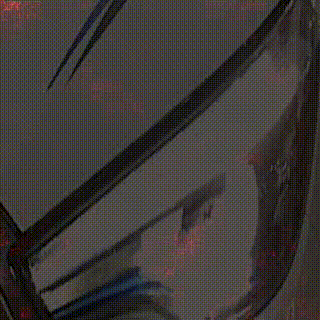
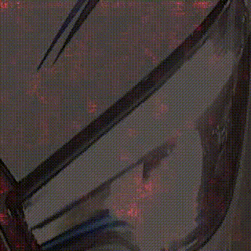

VideogradVis is an advanced package that encompasses cutting-edge methods for Explainable AI (XAI) in the realm of computer vision. This versatile tool is designed to facilitate the diagnosis of model predictions, serving a dual purpose in both production environments and during the model development phase. Beyond its practical applications, the project also serves as a comprehensive benchmark, offering a robust foundation for researchers to explore and evaluate novel explainability methods.

## <div align="center">Installation</div>
```bash
python setup.py install
```

## <div align="center">Usage</div>
```bash
import torch
from VideogradVis.Vis import GradVis

odel = torch.hub.load('facebookresearch/pytorchvideo', 'x3d_m', pretrained=True)
model.blocks[5].proj = nn.Linear(in_features = 2048, out_features = args.classes, bias = True)
print(f"Loading weights: {args.checkpoint}.")
model.load_state_dict(torch.load(args.checkpoint))

vis = GradVis(model)

model_input = torch.rand((1,3,120,250,250)).requires_grad_(True) #(B,C,T,H,W)
vis.compute_grad(input_tensor=input_model, path='/home/osama/pytorch-video/output/')

```
# Model Predictions Visualization

This document provides visualizations explaining the model's predictions on whether a headlight is ON or OFF. Each figure offers insights into the gradients and features that influenced the model's decision-making process.

## Visualizations


  
*Figure 1: Visualization explaining the model's prediction that the headlight is ON.*


  
*Figure 2: Detailed grads highlighting reasons behind the ON headlight prediction.*


  
*Figure 3: Insights into the model predicting the headlight as OFF.*


